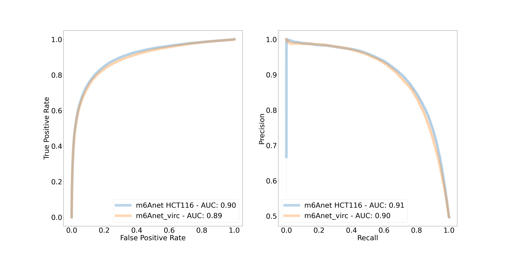

# m6anet


m6anet is a python tool that leverages Multiple Instance Learning framework to detect m6a modifications from Nanopore Direct RNA Sequencing data

# Table of Contents
- **[Running m6Anet](#running-m6anet)**<br>
    - **[Installation](#installation)**<br>
    - **[Dataprep](#dataprep)**<br>
    - **[Inference](#inference)**<br>
- **[Release Notes](#release-notes)**<br>
    - **[2.1.0](#release-note-210)**<br>
    - **[2.0.0](#release-note-200)**<br>
- **[Getting Help](#getting-help)**<br>
- **[Citing](#citing-m6anet)**<br>
- **[Contributors](#contributors)**<br>
- **[License](#license)**<br>

# Running m6Anet

## Installation

m6anet requires [Python version 3.7 or higher](https://www.python.org). To install the latest release with PyPI (recommended) run

```sh
$ pip install m6anet
```

Or, one can also install via conda with the following command:
```sh
$ conda install m6anet
```

See our documentation [here](https://m6anet.readthedocs.io/)!

## Dataprep

m6Anet dataprep requires eventalign.txt from ``nanopolish eventalign``:
```
    nanopolish eventalign --reads reads.fastq --bam reads.sorted.bam --genome transcript.fa --scale-events --signal-index --summary /path/to/summary.txt  --threads 50 > /path/to/eventalign.txt
```
This function segments raw fast5 signals to each position within the transcriptome, allowing m6Anet to predict modification based on the segmented signals. In order to run eventalign, users will need:
* ``reads.fastq``: fastq file generated from basecalling the raw .fast5 files
* ``reads.sorted.bam``: sorted bam file obtained from aligning reads.fastq to the reference transcriptome file
* ``transcript.fa``: reference transcriptome file

We have also provided a demo eventalign.txt dataset in the repository under /path/to/m6anet/m6anet/tests/data/eventalign.txt. Please see [Nanopolish](https://github.com/jts/nanopolish) for more information.

After running nanopolish eventalign, we need to preprocess the segmented raw signal file using 'm6anet dataprep'::
```
    m6anet dataprep --eventalign /path/to/m6anet/m6anet/tests/data/eventalign.txt \
                    --out_dir /path/to/output --n_processes 4
```

The output files are stored in ``/path/to/output``:

* ``data.json``: json file containing the features to feed into m6Anet model for prediction
* ``data.log``: Log file containing all the transcripts that have been successfully preprocessed
* ``data.info``: File containing indexing information of data.json for faster file access and the number of reads for each DRACH positions in eventalign.txt
* ``eventalign.index``: Index file created during dataprep to allow faster access of Nanopolish eventalign.txt during dataprep


## Inference

Once `m6anet dataprep` finishes running, we can run `m6anet inference` on the dataprep output:
```
    m6anet inference --input_dir path/to/output --out_dir path/to/output  --n_processes 4 --num_iterations 1000
```

m6anet inference will run default human model trained on the HCT116 cell line. In order to run Arabidopsis-based model or the HEK293T-RNA004-based model, please supply the `--pretrained_model` argument:
```
    ## For the Arabidopsis-based model

    m6anet inference --input_dir path/to/output --out_dir path/to/output  --pretrained_model arabidopsis_RNA002 --n_processes 4 --num_iterations 1000

    ## For the HEK293T-RNA004-based model

    m6anet inference --input_dir path/to/output --out_dir path/to/output  --pretrained_model HEK293T_RNA004 --n_processes 4 --num_iterations 1000
```
m6Anet will sample 20 reads from each candidate site and average the probability of modification across several round of sampling according to the --num_iterations parameter.
The output file `data.indiv_proba.csv` contains the probability of modification for each read

* ``transcript_id``: The transcript id of the predicted position
* ``transcript_position``: The transcript position of the predicted position
* ``read_index``: The read identifier from nanopolish that corresponds to the actual read_id from nanopolish summary.txt
* ``probability_modified``: The probability that a given read is modified

The output file `data.site_proba.csv` contains the probability of modification at each individual position for each transcript. The output file will have 6 columns

* ``transcript_id``: The transcript id of the predicted position
* ``transcript_position``: The transcript position of the predicted position
* ``n_reads``: The number of reads for that particular position
* ``probability_modified``: The probability that a given site is modified
* ``kmer``: The 5-mer motif of a given site
* ``mod_ratio``: The estimated percentage of reads in a given site that is modified

The mod_ratio column is calculated by thresholding the ``probability_modified`` from `data.indiv_proba.csv` based on the ``--read_proba_threshold`` parameter during ``m6anet inference`` call,
with a default value of 0.033379376 for the default human model HCT116_RNA002 and 0.0032978046219796 for arabidopsis_RNA002 model. We also recommend a threshold of 0.9 to select m6A sites from the ``probability_modified`` column in ``data.site_proba.csv``.
The total run time should not exceed 10 minutes on a normal laptop.


m6Anet also supports pooling over multiple replicates. To do this, simply input multiple folders containing m6anet-dataprep outputs::
```
        m6anet inference --input_dir data_folder_1 data_folder_2 ... --out_dir output_folder --n_processes 4 --num_iterations 1000
```

# Release Notes

## Release Note 2.1.0

### m6anet model trained with RNA004 chemistry (development version)


The default m6Anet model was trained with the currently available RNA002 direct RNA-Seq kit. Oxford Nanopore is currently providing access to the development version of the next version, RNA004. To make m6A detection possible with RNA004, we now provide an m6Anet model trained on direct RNA
Seq data from the HEK293T cell line using the development version of RNA004. In order to call m6A on data from the RNA004 kit, the following commands can be used:

1. <b>Pre-processing/segmentation/dataprep.</b> <br>
    + Please use f5c with the RNA004 kmer model, as described [here](https://github.com/hasindu2008/f5c/releases/tag/v1.3)
    +   The kmer model can be downloaded [here](https://raw.githubusercontent.com/hasindu2008/f5c/v1.3/test/rna004-models/rna004.nucleotide.5mer.model)

    Then execute eventalign with --kmer-model pointing to the path to the downloaded k-mer model as follows:
    ```
    f5c eventalign --rna -b reads.bam -r reads.fastq -g transciptome.fa -o eventalign.tsv \
    --kmer-model /path/to/rna004.nucleotide.5mer.model --slow5 reads.blow5 --signal-index \
    --scale-events
    ```

    The output can then be used with m6Anet dataprep (see https://m6anet.readthedocs.io/en/latest/quickstart.html)

2. <b>Inference</b> <br>
In order to identify m6A from RNA004 data, the RNA004 model has to be specified:
    ```
        m6anet inference --input_dir [INPUT_DIR] --out_dir [OUT_DIR] --pretrained_model HEK293T_RNA004
    ```
    The RNA004 model is trained on the development version and only underwent limited evaluation on site-level prediction compared to the RNA002 model. The individual read probability accuracy for RNA004 has not been tested. Please report any feedback to us (https://github.com/GoekeLab/m6anet/discussions)


### Training and evaluating the RNA004 m6anet


We trained m6anet using an RNA004 direct RNA-Seq run of the HEK293T cell line, with m6A positions defined by m6ACE-Seq. We then evaluated the RNA004-based m6anet performance on RNA004 data from the Hek293T and the Hct116 cell line. Here, we used the intersection of all sites identified both in the RNA002 and the RNA004 data to compare the RN004 model (tested on RNA004 data) and the RNA002 model (tested on RNA002 data), using m6ACE-Seq as ground truth (Figure 1-2). The results suggest a comparable performance between the RNA002-trained and the RNA004-trained m6anet.

Please note that the RNA004 will generate higher read numbers, which leads to a higher number of sites being tested.

<table>
    <table border="1">
    <tr>
    <th><center>HEK293T</th>
    <th><center>HCT116</th>
  </tr>
  <tr>
    <td> </td>
    <td> </td>
  </tr>
</table>


Figure 1: ROC curve comparing the m6Anet model trained on RNA002 and evaluated on RNA002 data with the model trained on RNA004 and evaluated on RNA004. Only sites that were detected in both data sets are used in this comparison. Here, a MAPQ filter of 20 was applied.

<table>
<table border="1">
<tr>
<th><center>HEK293T</th>
<th><center>HCT116</th>
  </tr>
  <tr>
    <td> </td>
    <td> </td>
  </tr>
</table>

Figure 2: ROC curve comparing the m6Anet model trained on RNA002 and evaluated on RNA002 data with the model trained on RNA004 and evaluated on RNA004. Only sites that were detected in both data sets are used in this comparison. Here, a MAPQ filter of 0 was applied to the RNA004 data, leading to a higher number of sites which are detected.


### Acknowledgments


We thank Hasindu Gamaarachchi, Hiruna Samarakoon, James Ferguson, and Ira Deveson from the Garvan Institute of Medical Research in Sydney, Australia for enabling the eventalign of the RNA004 data with f5c. We thank Bing Shao Chia, Wei Leong Chew, Arnaud Perrin, Jay Shin, and Hwee Meng Low from the Genome Institute of Singapore for providing the RNA and generating the direct RNA-Seq data, and we thank Paola Florez De Sessions, Lin Yang, Adrien Leger, Lakmal Jayasinghe, Libby Snell, Etienne Raimondeau, and Oxford Nanopore Technologies for providing early access to RNA004, generating the Hek293T data that was used to train the m6Anet model, and for feedback on the results. The model was trained and implemented by Yuk Kei Wan.


## Release Note 2.0.0

### API Changes

The m6Anet functions for preprocessing, inference, and training have now been simplified. We now provide a single entry point for all m6anet functionalities through the m6anet module. This means
that all the old functionalities of m6Anet are now available through the m6anet module call, such as ``m6anet dataprep``, ``m6anet inference`` and ``m6anet train`` functions. The command ``m6anet-dataprep``,
``m6anet-run_inference`` and ``m6anet-train`` are deprecated and will be removed in the next version. Please check our updated [Quickstart](https://m6anet.readthedocs.io/en/latest/quickstart.html) and [Training page](https://m6anet.readthedocs.io/en/latest/training.html) for more details on running m6Anet.

We have also made some changes to the m6anet dataprep function. Previously m6anet-dataprep produces data.index and data.readcount files to run inference, and we realized that this can be simplified by combining the two files together. The current m6anet dataprep (and also the deprecated ``m6anet-dataprep``) now produces a single data.info file that combines the information from both data.index and data.readcount. Furthermore, m6anet inference (also the deprecated m6anet-run_inference) now requires data.info file to be present in the input directory. We have also provided a function for users to convert older dataprep output files to the newest format using:
```
   m6anet convert --input_dir /path/to/old/dataprep/output --out_dir /path/to/old/dataprep/output
```
This function will create data.info file by combining the old data.index and data.readcount files. The users still need to make sure that data.info file is located in the same folder as data.json file


### Faster and Better Inference Implementation

In order to minimize the effect of sequencing depth in m6Anet prediction, a fixed number of reads are sampled from each site during m6Anet training.
This process is repeated during inference where the sampling will be repeated several times for each candidate site to stabilize the modification probability.
The number of sampling rounds is controlled through the option `--num_iterations` and the default was set to 5 in the previous version of m6Anet to minimize running time.

\
A low number of sampling iterations results in unstable probability value for individual sites and while the overall performance of m6Anet on large datasets remains unaffected, users looking to identify
and study modifications on individual sites will benefit from a more consistent modification score. In m6Anet 2.0.0, we have improved the inference process so that it can accommodate a higher
number of sampling iterations while still maintaining a relatively fast inference time. Here we include the comparison between the older m6Anet version against the current release in terms of their peak memory usage and running time
over a different number of sampling rounds on our HEK293T dataset with 95030 sites and 8019824 reads. The calculation is done on AMD EPYC 7R32 with `--num_processes` set to 25.

<table>
<table border="1">
<tr>
<th><center>Version Number</th>
<th><center>Peak Memory Usage(MB)</th>
<th><center>Running Time(s) </th>
<th><center>Number of Iterations</th>
</tr>
<tr>
<th><center>m6Anet v-1.1.1</th>
<th><center>480.5</th>
<th><center>8876.77 </th>
<th><center>50</th>
</tr>
<tr>
<th><center>m6Anet v-1.1.1</th>
<th><center>677.9</th>
<th><center>18009.92 </th>
<th><center>100</th>
</tr>
<tr>
<th><center>m6Anet v-2.0.0</th>
<th><center>553.7</th>
<th><center>392.91</th>
<th><center>5</th>
</tr>
<tr>
<th><center>m6Anet v-2.0.0</th>
<th><center>571.3 </th>
<th><center>229.92 </th>
<th><center>50</th>
</tr>
<th><center>m6Anet v-2.0.0</th>
<th><center>576.4</th>
<th><center>409.71</th>
<th><center>100</th>
</tr>
<th><center>m6Anet v-2.0.0</th>
<th><center>578.5</th>
<th><center>408.17</th>
<th><center>1000</th>
</tr>
</table>


As we can see, the latest version of m6Anet has relatively constant peak memory usage with minimal difference in running time between 100 and 1000 iteration runs. To achieve this, m6Anet
saves each individual read probability file in `data.indiv_proba.csv` before sampling the required amount of reads for each site in parallel. The site level probability is then
saved in `data.site_proba.csv`.


### Rounding of Dataprep Output

Users can now add `--compress` flag to `m6anet dataprep` to round the dataprep output features to 3 decimal places. In our experience, this reduces the file size for
data.json significantly without compromising model performance.

### Arabidopsis Trained m6Anet

We have also included m6Anet model trained on the [Arabidopsis VIRc dataset](https://elifesciences.org/articles/78808) from [our paper](https://www.nature.com/articles/s41592-022-01666-1) as an option for users who are looking to study m6A modification on plant genomes or to aggregate predictions from different m6Anet models on their datasets. Here we present single molecular probability results on synthetic RNA from the [curlcake dataset](https://www.nature.com/articles/s41467-019-11713-9)



Figure 1: VIRc trained m6Anet single-molecular predictions on curlcake dataset.

The single-molecule m6A predictions of the Arabidopsis model seem to be comparable with the human model with ROC AUC of 0.89 and PR AUC of 0.90 on the synthetic. We also validate the ability to predict per-molecule
modifications of the Arabidopsis model on the human HEK293T METTL3-KO and wild-type samples that were mixed to achieve an expected relative m6A stoichiometry of 0%, 25%, 50%, 75%, and 100% from [xPore](https://www.nature.com/articles/s41587-021-00949-w) on the sites predicted to be modified in wild-type samples $(\textrm{probability} \geq 0.7)$. As we can see, from the 1041 shared sites that we inspect across the HEK293T mixtures, the median prediction of the model follows the expected modification ratio.


Figure 2: VIRc trained m6Anet single-molecular predictions on HEK293T mixtures dataset.

In order to run the Arabidopsis model, please add the following command when running m6anet inference

* ``--read_proba_threshold : 0.0032978046219796``
* ``--model_state_dict : m6anet/m6anet/model/model_states/arabidopsis_virc.pt``
* ``--norm_path : m6anet/m6anet/model/norm_factors/norm_factors_virc.joblib``

# Getting help
We appreciate your feedback and questions! You can report any error or suggestion related to m6Anet as an issue on [github](https://github.com/GoekeLab/m6anet/issues). If you have questions related to the manuscript, data, or any general comment or suggestion please use the [Discussions](https://github.com/GoekeLab/m6anet/discussions).

Thank you!


# Citing m6Anet

If you use m6Anet in your research, please cite
[Christopher Hendra, et al.,Detection of m6A from direct RNA sequencing using a Multiple Instance Learning framework. *Nat Methods* (2022)](https://doi.org/10.1038/s41592-022-01666-1)


# Contributors

This package is developed and maintaned by [Christopher Hendra](https://github.com/chrishendra93) and [Jonathan Göke](https://github.com/jonathangoeke). If you want to contribute, please leave an issue or submit a pull request. Thank you.

# License
m6Anet is licensed under the terms of the MIT license.
